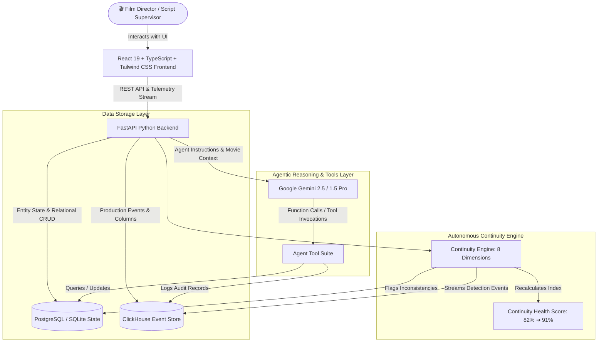
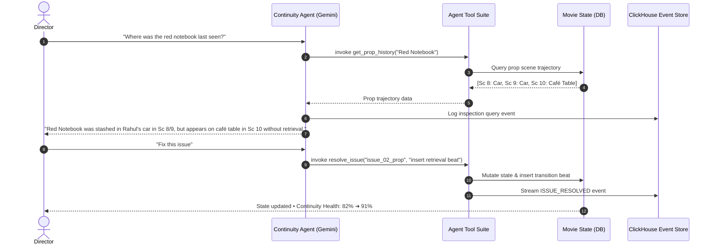

# Continuity Guardian

> *"Your movie remembers. Your production doesn't have to."*

**Continuity Guardian** is an autonomous agentic AI assistant engineered for film directors, script supervisors, assistant directors, and production managers. It continuously monitors and maintains a persistent "state of the movie" across scripts, scenes, shots, characters, wardrobe, props, locations, timeline chronology, and dialogue facts—proactively detecting contradictions, evaluating defect severity, and applying one-click production fixes.

Built for the **Google Cloud & ClickHouse Hackathon**.

---

## 🎬 The Core Problem

In feature films and episodic television, production teams shoot scenes out of sequence across hundreds of setups over multiple months. Small continuity mistakes happen constantly:

* **Wardrobe Mismatches**: A character wears a black leather jacket in Scene 10, but appears in a red jacket in Scene 11 with no costume change recorded.
* **Prop Teleportation**: A key prop is stashed inside a car, yet suddenly appears on a diner table without any retrieval event.
* **Location Jumps**: A character is at a train station at 1:00 AM and appears inside a hospital ward at 1:05 AM with zero transit time.
* **Physical Health Anomalies**: A character's arm is severely lacerated in Scene 4, yet appears completely uninjured and lifting heavy objects in Scene 6.
* **Timeline Inversion**: A scene timestamped at 6:30 PM chronologically follows an 8:00 PM scene without being marked as a flashback.
* **Knowledge Leaks**: A character refers to a secret embezzlement ledger in dialogue before the ledger was ever discovered in the story.

These errors cost film productions **tens of thousands of dollars in emergency reshoots** and post-production VFX paint-outs.

---

## 💡 The Solution: Autonomous Production Sentinel

Continuity Guardian is **not a generic chatbot**. It acts as an autonomous virtual script supervisor that:

1. **Maintains Structured Movie State**: Tracks character wardrobe, physical health, current location, prop custody, and discovered facts scene-by-scene.
2. **Runs an 8-Dimensional Continuity Engine**: Multi-vector rule and semantic reasoning checking wardrobe, props, locations, physical state, timeline chronology, weather, dialogue facts, and knowledge leaks.
3. **Explains Contradictions**: Provides clear reasoning comparing established previous state vs contradictory current state.
4. **Suggests Actionable Fixes**: Generates 3 intelligent resolution options (e.g. adjust costume state, insert transitional action beat, or mark intentional exception).
5. **Applies One-Click State Mutations**: Filmmakers can approve a fix, immediately updating the movie state and resolving the issue.
6. **Maintains ClickHouse Analytical Telemetry**: Streams production events and state changes to ClickHouse for real-time risk density heatmaps and defect tracking.

---

## 🏛️ System Architecture



---

## 🤖 Agentic Behavior & Tool Calling

Unlike basic prompt wrappers, Continuity Guardian implements a true autonomous agent loop:



### Agent Tool Suite:
* `get_scene(scene_id)`: Fetches scene metadata, slugline, characters present, props, and flagged flaws.
* `get_character_history(character)`: Traverses scene-by-scene wardrobe, injury, and location journey.
* `get_prop_history(prop)`: Traverses physical custody and location movements across all scenes.
* `get_location_history(location)`: Retrieves all filming setups occurring at a location.
* `search_movie_state(query)`: Global multi-entity search across dialogue, events, and notes.
* `resolve_issue(issue_id, resolution_text)`: Resolves an error and triggers state repair.
* `update_scene(scene_id, updates)`: Modifies scene parameters and synchronizes state.
* `create_production_note(content)`: Attaches notes to call sheets and slates.

---

## ⚡ ClickHouse Integration

Continuity Guardian uses **ClickHouse** as the real-time analytical event backbone for film production:
* **High-Throughput Production Event Log (`production_events`)**: Records every state transition, costume change, prop custody handover, and camera unit update.
* **Defect Density Analytics (`continuity_analytics_log`)**: Columnar aggregation powering defect heatmaps by scene, character volatility rankings, and health score trajectory.
* **Zero-Friction Fallback**: When running locally without an external ClickHouse container, the backend activates a high-performance in-memory analytical event engine with identical schema and query semantics.

---

## 🌟 Pre-Loaded Demo Project: *"Midnight at Platform 7"*

Continuity Guardian automatically initializes with a complete neo-noir feature project:
* **14 Filming Scenes** spanning 11:58 PM to 1:30 AM across 4 locations: *Platform 7, Station Café, Rahul's Car, Metro Hospital*.
* **5 Key Characters**: Rahul (Protagonist), Priya (Journalist), Arjun (Yard Master), Meera (Sister), Inspector Singh (CID).
* **8 Hero Props**: Red Notebook, Silver Watch, Black Backpack, Car Keys, Old Photograph, Burner Phone, Police Badge, Sealed Envelope.
* **6 Intentional Continuity Flaws Ready for Testing**:
  1. 🔴 **Wardrobe Swap (Sc 10 ➔ 11)**: Rahul wears Black Leather Jacket in Sc 10, then Red Bomber Jacket in Sc 11 in the same booth.
  2. 🔴 **Prop Teleportation (Sc 08 ➔ 10)**: Red Notebook stashed in locked car appears on diner table without retrieval.
  3. 🟠 **Location Teleportation (Sc 12 ➔ 13)**: Priya moves from Café to Hospital in 5 minutes with zero travel recorded.
  4. 🟠 **Physical Health Inconsistency (Sc 04 ➔ 06)**: Severe left arm laceration in Sc 04 disappears with no medical care in Sc 06.
  5. 🟡 **Timeline Inversion (Sc 02 ➔ 03)**: Scene 03 (6:30 PM) follows Scene 02 (8:00 PM) without a flashback designation.
  6. 🟠 **Knowledge Leak (Sc 01 ➔ 02)**: Rahul explicitly quotes 200,000 embezzlement before discovering the ledger.

---

## 🚀 Quickstart Guide

### Prerequisites
* **Node.js**: v18+ (v20+ recommended)
* **Python**: 3.10+
* **Git**

### 1. Clone & Setup
```bash
git clone https://github.com/NakulGupta-0608/Continuity-Guardian.git
cd Continuity-Guardian
```

### 2. Environment Variables
Copy `.env.example` to `.env`:
```bash
cp .env.example .env
```
*(Optional: Add your `GEMINI_API_KEY` from [Google AI Studio](https://aistudio.google.com/) for live LLM reasoning).*

### 3. Run Backend (FastAPI)
```bash
# Install Python dependencies
pip install -r backend/requirements.txt

# Start backend server
uvicorn backend.app.main:app --reload --port 8000
```
Backend API will be available at: `http://localhost:8000` (Swagger docs at `/docs`).

### 4. Run Frontend (React + Vite)
```bash
cd frontend
npm install
npm run dev
```
Frontend will launch at: `http://localhost:5173`.

---

## 🐳 Docker Deployment (One-Command Boot)

To run the complete production stack (PostgreSQL + ClickHouse + FastAPI + React Frontend):

```bash
docker-compose up --build
```

---

## 🧪 Running Automated Tests

```bash
# Run unit & continuity verification tests
python -m unittest backend/tests/test_continuity.py
```

All 7 core test suites verify database seeding, multi-dimensional continuity checks, agent tool calls, prop tracking, and issue resolution.

---

## 🎯 3-Minute Hackathon Demo Script

1. **Dashboard Overview**:
   - Open `http://localhost:5173`.
   - Observe **14 Scenes, 5 Characters, 8 Props, 6 Flagged Flaws**, and **Continuity Health: 82%**.
2. **Inspect Flagged Issues**:
   - Navigate to the **Continuity Issues** tab.
   - Inspect **Issue #1 (Wardrobe)**: Shows Scene 10 Black Jacket vs Scene 11 Red Jacket.
   - Inspect **Issue #2 (Prop Teleportation)**: Shows Red Notebook stashed in car appearing on café table.
3. **Trigger Real-Time Continuity Check**:
   - Click the prominent **"Run Continuity Check"** button in the header.
   - Watch the multi-vector engine verify all 14 scenes.
4. **Interact with AI Agent Copilot**:
   - Click **"AI Copilot"** or select the preset question: *"Where was the red notebook last seen?"*.
   - Watch the agent invoke `get_prop_history()` and report the car-to-café anomaly.
5. **Apply a 1-Click Fix**:
   - Click **"Apply Fix"** on the Wardrobe or Notebook issue.
   - State updates instantly, the issue marks as **RESOLVED**, and the Continuity Health score updates: **82% ➔ 91%**!
6. **ClickHouse Telemetry Stream**:
   - Navigate to **ClickHouse Analytics** to inspect the real-time event audit log.

---

## 📋 Hackathon Compliance Summary

| Requirement | Implementation Detail |
|---|---|
| **Google Cloud / Gemini** | Integrated via `google-genai` SDK with function calling, structured tool execution (`backend/app/agents/continuity_agent.py`), and context retrieval. |
| **ClickHouse Analytical Store** | Integrated via `clickhouse-connect` (`backend/app/database/clickhouse.py`) for streaming production events and columnar metrics. |
| **Relational App State** | PostgreSQL / SQLite with SQLAlchemy for structured movie entities (`backend/app/database/models.py`). |
| **Autonomous Agent Flow** | Agent uses tools to query movie state, detect inconsistencies, and execute approved state updates. |

---

## 📄 License

MIT License © 2026 Continuity Guardian Team.
